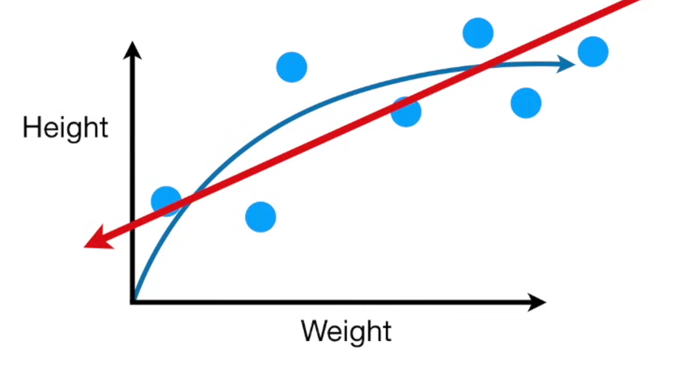
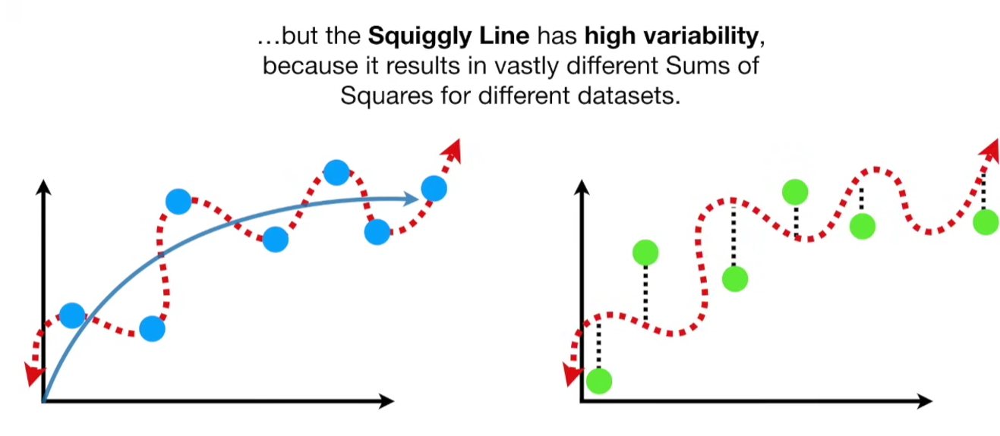

Bias: Bias is the inability for a mcahine learning method (like linear regression) to capture the true relationship

If we do overfitting, we get a very low MSE for the training set, but a very high one for the Test set. 

This leads to a high Variance - this is the case in overfit

In ML we want low bias and low variability (high consistency)
This happens by finding the sweet spot between simple (high bias) and complicated (high variance) models

3 commonly used methods are:

1. regularization
2. boosting
3. bagging

Normalizing values Turns numbers into z-scores so they have mean 0 and variance 1.
This is common preprocessing in ML.