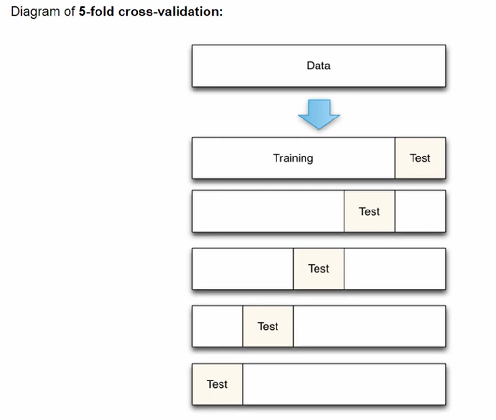

Advantages of cross-validation
- More accurate estimate of out -of-sample accuracy
- More "efficient" use of data (every observation is used for both training and testing)

Advantages of train/test split
- Runs K times faster than K-fold cross-validation
- Simpler to examine the detailed results of the testing process.

Recommendations for the use of cross-validation
- K can be any number, K=10 is generally recommended
- For classification problems, stratified sampling is recommended for creating the folds. 
        eg if dataset has two response classes (eg HAM, SPAM) and 20% of observations are HAM then each of the cross validation folds (each of the 10) should have 20% HAM
        scikit-learn does this by itself

CROSS VALIDATION is great for parameter tuning

# Day 4 Notes — scikit-learn baseline + Ridge + evaluation

## What I did
- Loaded the diabetes dataset (X: features, y: target).
- Split into train/test (80/20) with random_state=42.
- Trained a baseline regressor (DummyRegressor, predict-mean).
- Trained a Ridge regression model using a Pipeline:
  StandardScaler -> Ridge(alpha=1.0).
- Evaluated with RMSE and R² on the test set.
- (Optional) Ran residual diagnostics: predicted vs true, residuals vs predicted, residual histogram.

## Results (test set)
- Baseline RMSE: 79.16
- Baseline R²: ~0.00
- Ridge RMSE: 54.02
- Ridge R²: 0.533

## Key concepts (in my words)
- Baseline: always train a “do-nothing” model to know what improvement is meaningful.
- RMSE: typical prediction error magnitude (lower is better).
- R²: fraction of variance explained; ~0 means baseline, <0 worse than baseline.
- Pipeline avoids leakage: scaler is fit only on training data and applied consistently.

## Residual diagnostics (what I observed)
- Predicted vs True: (write 1 sentence)
- Residuals vs Predicted: (write 1 sentence; any curve/fan/outliers?)
- Residual histogram: (write 1 sentence; symmetric or skewed?)

## One evaluation/leakage risk to watch in Proxy-style data
- If the same recipe_id / panelist_id / batch appears in both train and test, metrics look too good (leakage). Prefer group-based splits when appropriate.

## One question to ask the team
- What is our splitting strategy (random vs time vs group by recipe/panelist), and what metric is the KPI for success?
